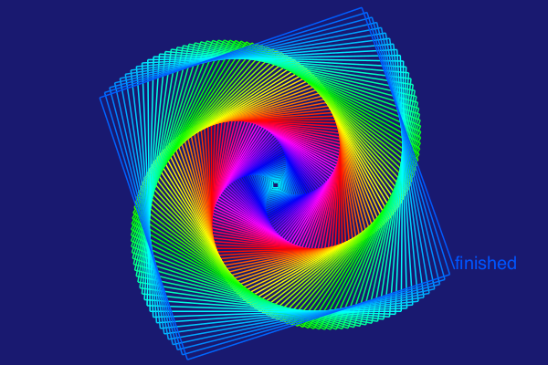

# Creative Coding: Assignment 4

For this assignment, I kept it fairly simple. I found the inspiration for this assignment online, which looks like it could have been done in Python, so I thought I would try to recreate it. I added some white stars at the end of the code to add some pizzazz! 

[Code](myturtle.py)

### Inspiration

### Final Product

